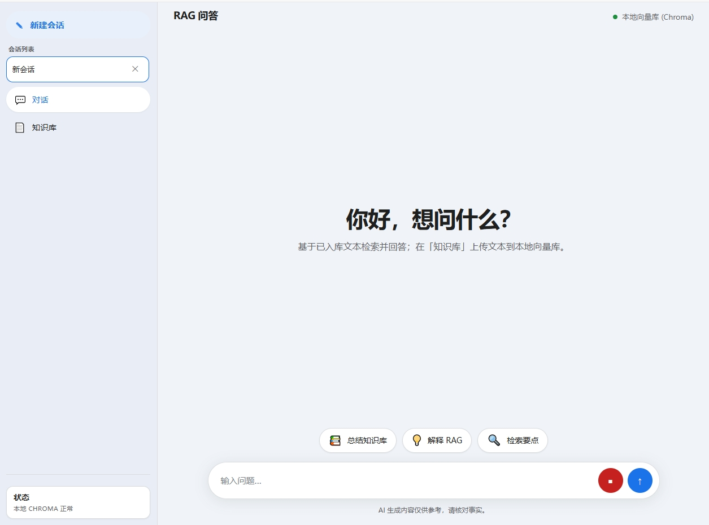
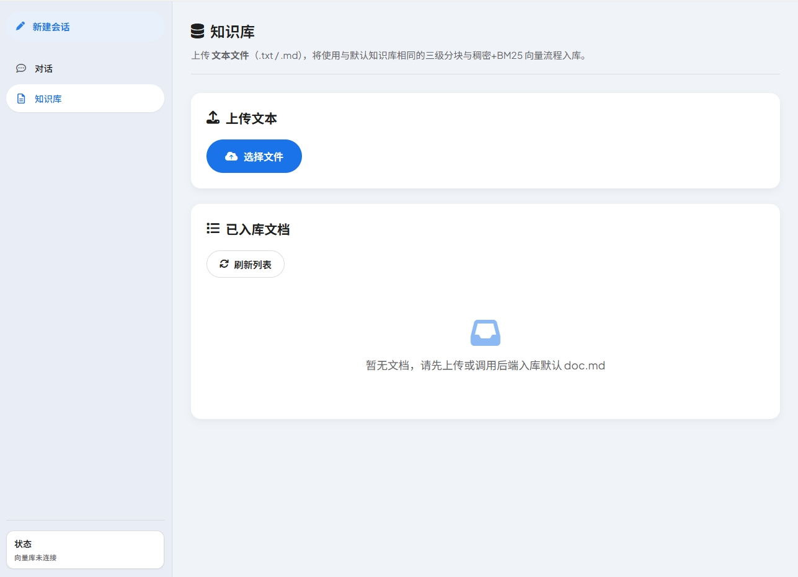
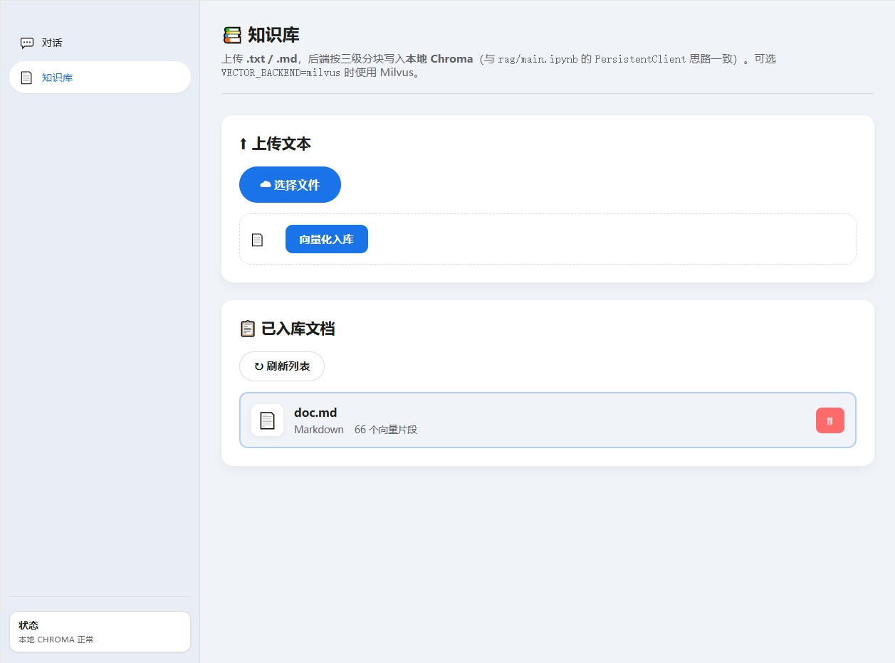
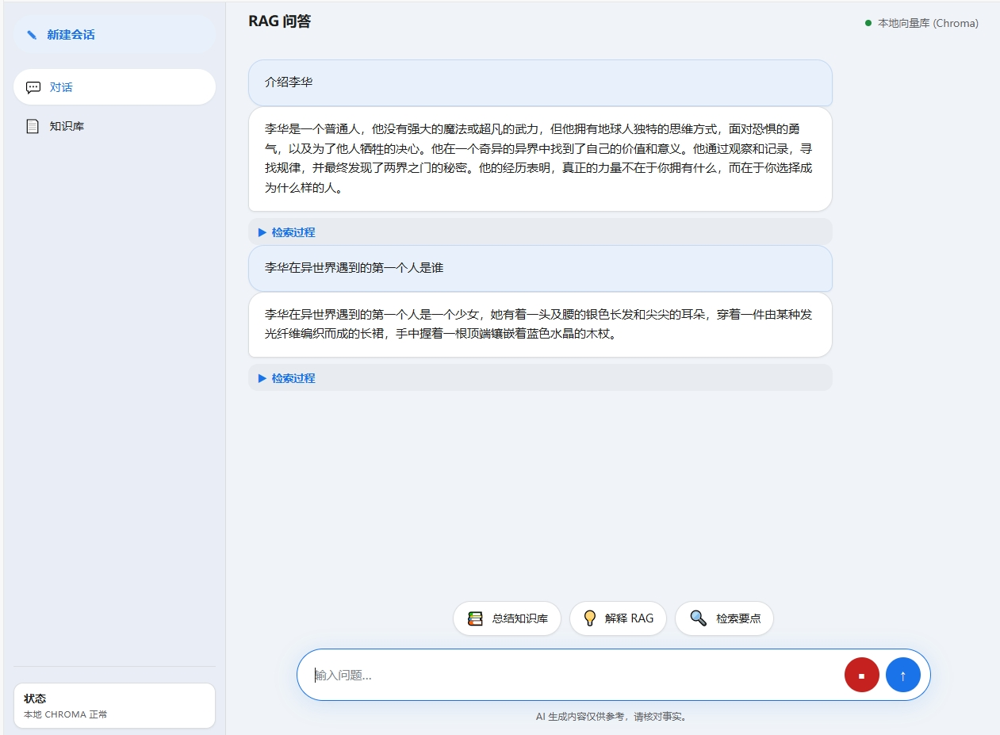

# rag-new

A **retrieval-augmented generation (RAG)** service built with **FastAPI**. It ingests Markdown/text, stores dense embeddings in **ChromaDB** by default (same idea as a local `PersistentClient` notebook flow), and optionally uses **Milvus** for hybrid dense + BM25 retrieval. A small static web UI (under `../rag/frontend`) provides chat, document upload, and health checks.

## Features

- **Vector store**: **Chroma** locally by default (`VECTOR_BACKEND` unset or `chroma`); optional **Milvus** hybrid search when `VECTOR_BACKEND=milvus`.
- **Ingestion**: Three-level chunking, parent chunks in SQLite, leaf chunks embedded and written to the active vector backend.
- **RAG flow**: **LangGraph**-based graph (retrieve → grade → optional query rewrite / expanded retrieval) plus an OpenAI-compatible chat step for answers (e.g. Alibaba **DashScope** / Qwen).
- **API**: REST endpoints for ingest, document list/delete, `/rag/complete`, and `/health`.
- **UI**: Vanilla JS frontend served from the backend; open `http://127.0.0.1:8001` (not `file://`).

## Screenshots

| Main UI | Upload |
|--------|--------|
|  |  |

| Upload done | Q&A chat |
|-------------|----------|
|  |  |

## Requirements

- **Python 3.12+**
- Network access for the first run if the embedding model is downloaded from Hugging Face (configure `HF_ENDPOINT` if needed).
- For **generated answers**: a **DashScope** (Model Studio) API key and compatible base URL in `.env`.

## Quick start

```bash
cd rag_new
cp .env.example .env
# Edit .env: DASHSCOPE_API_KEY, MODEL, etc.

pip install -e .
python serve.py
```

Open `http://127.0.0.1:8001`. Default port is **8001** (`PORT` env overrides).

### Optional: uv

```bash
cd rag_new
uv venv
# Windows: .venv\Scripts\activate
uv pip install -e .
python serve.py
```

## Configuration


| Variable                | Purpose                                                  |
| ----------------------- | -------------------------------------------------------- |
| `VECTOR_BACKEND`        | `chroma` (default) or `milvus`                           |
| `CHROMA_PERSIST_PATH`   | Chroma persistence directory (default: `data/chroma_db`) |
| `DASHSCOPE_API_KEY`     | LLM / grading via OpenAI-compatible API                  |
| `BASE_URL`              | e.g. `https://dashscope.aliyuncs.com/compatible-mode/v1` |
| `MODEL` / `GRADE_MODEL` | Chat and grader model names                              |
| `EMBEDDING_MODEL`       | Dense embedding model (e.g. `BAAI/bge-m3`)               |


Copy `.env.example` to `.env` and fill in secrets. Do not commit `.env`.

## Project layout

```text
rag_new/
  serve.py           # Uvicorn entry
  backend/
    app.py             # FastAPI app, routes, static mount
    chroma_store.py    # Local Chroma persistence
    rag_pipeline.py    # LangGraph RAG graph
    rag_utils.py       # Retrieval, rerank hooks, etc.
  ../rag/frontend/     # Static UI (HTML / CSS / JS)
```

## API (summary)


| Method | Path             | Description                      |
| ------ | ---------------- | -------------------------------- |
| GET    | `/health`        | Backend + vector store status    |
| POST   | `/ingest/upload` | Upload `.txt` / `.md`            |
| POST   | `/ingest/doc`    | Ingest from server path          |
| GET    | `/documents`     | List ingested files              |
| DELETE | `/documents`     | Remove by `filename` query param |
| POST   | `/rag/complete`  | Retrieve + optional LLM answer   |


## Troubleshooting

- **Failed to fetch** in the browser: Start the server and open the app at `http://127.0.0.1:8001`. Do not open `index.html` via `file://`.
- **First ingest is slow**: Embedding model download and CPU encoding can take minutes.
- **DashScope 400s** (e.g. `enable_thinking`, `json` in messages): The backend sets parameters required by the compatible API for non-streaming and structured calls; use a model enabled in your cloud console.

## License

Add a `LICENSE` file if you distribute this repository. No license is implied by this README alone.